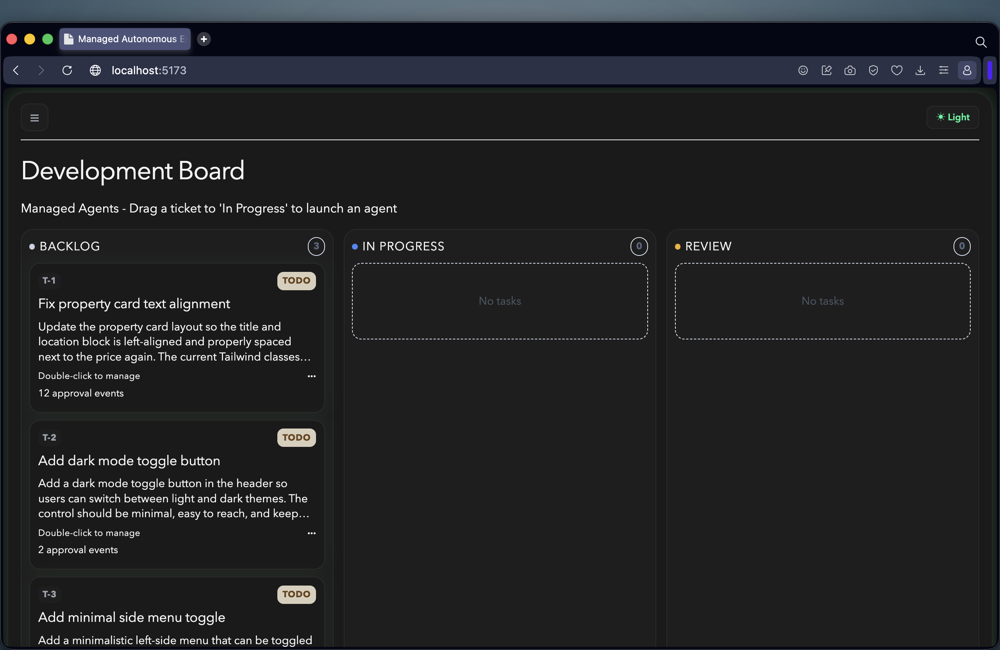

# Managed Autonomous Engineering Board

[▶️ Watch the demo](managed-autonomous-engineering-board-demo.mp4)
 
 
Managed Autonomous Engineering Board is a full-stack application that models a software delivery lifecycle as a drag-and-drop board powered by managed AI agents.

When a task moves across phases, the platform can launch role-specific agents (developer, reviewer, tester), stream runtime activity, apply human approval gates for protected transitions, and persist task state for continuity.

## What This Project Demonstrates

- Multi-phase engineering workflow: todo -> in-progress -> in-review -> testing -> done.
- Managed agent orchestration with a simulated fallback mode when managed runtime prerequisites are missing.
- Human approval controls for high-impact state transitions.
- Runtime health diagnostics for agent registration and MCP readiness.
- Lightweight docs search through a local RAG endpoint over the specs directory.

## Repository Layout

- backend: NestJS API for tasks, sessions, approvals, and RAG search.
- frontend: React + Vite UI for the engineering board and agent runtime visibility.
- mcp-vercel-functions: Optional MCP adapter deployment for GitHub operations.
- specs: Product, roadmap, and implementation documents.

## Read More

- Backend guide: backend/README.md
- Frontend guide: frontend/README.md
- Agent architecture overview: AGENTS.md
